# US-3.1 — Create System Sequence Diagrams (SSDs)
## Overview
Create System Sequence Diagrams (SSDs) for major CacheScope interactions to model external actor-to-system behavior before implementation begins.

This user story establishes the system-level interaction contracts between users and CacheScope and defines:
* actor → system communication
* system events
* inputs and outputs
* operation sequencing
* boundary responsibilities
* behavioral validation
* implementation guidance

SSDs intentionally treat CacheScope as a single black-box system.
Internal object collaboration belongs later in US-3.2 — Sequence Diagrams.

## User Story
As a software designer,
I want to model user-to-system interactions before implementation,
so that CacheScope behavior is formally defined and implementation remains traceable to requirements.

## Objectives
Create SSDs for the following primary workflows:
1. Configure Cache
2. Submit Memory Address
3. Visualization Update

## Scope
#### Included:
* external actor interactions
* system events
* responses
* validation feedback
* state transitions
* alternate execution paths
#### Excluded:
* internal object communication
* class responsibilities
* algorithm implementation
* replacement-policy internals

## Primary Actor
User

## Supporting System
CacheScope

## Inputs

| Input               |
| :---                |
| Cache configuration |
| Memory address      |
| Simulation commands |

## Outputs

| Output                |
| :---                  |
| Validation result     |
| Translation result    |
| Visualization update  |
| Cache hit/miss result |
| Simulation feedback   |

## Business Rules

| ID        | Rule                                               |
| :---      | :---                                               |
| BR-SSD-01 | SSDs represent only actor-to-system interactions.  |
| BR-SSD-02 | Internal subsystem behavior must not appear.       |
| BR-SSD-03 | SSD operations must align with use cases.          |
| BR-SSD-04 | SSD operations become candidate system operations. |
| BR-SSD-05 | All SSDs must remain implementation-independent.   |

## SSD-1 — Configure Cache
### Related Use Cases
* UC-2.1 Configure Cache
* UC-2.2 Validate Cache Configuration
* UC-2.3 Apply Cache Configuration

## Goal
Configure cache parameters and prepare simulation.

## System Events

| Actor                                                       | System                        |
| :---                                                        | :---                          |
| openConfiguration()                                         |                               |
| configureCache(cacheSize, associativity, blockSize, policy) |                               |
|                                                             | validateConfiguration()       |
|                                                             | applyConfiguration()          |
|                                                             | initializeSimulation()        |
|                                                             | displayConfigurationSuccess() |

## SSD Representation

<div align='center'>
  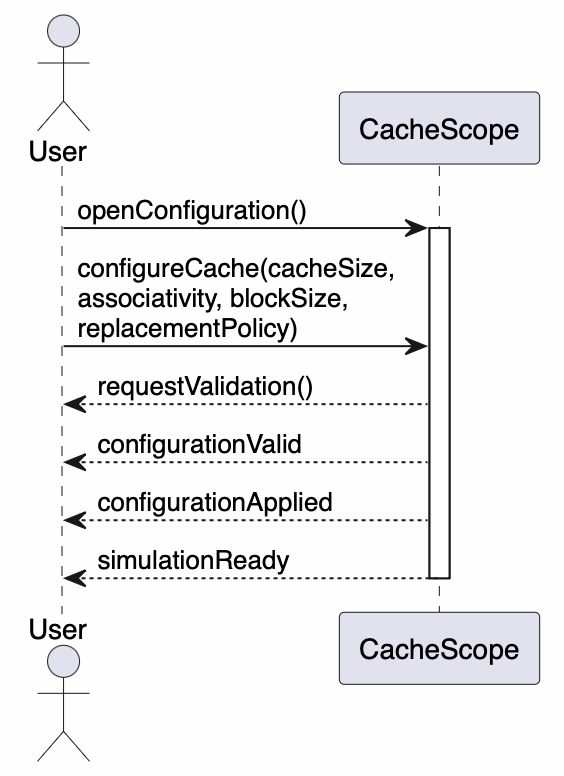
  <p><b>Fig. 1:</b> Configure Cache - Main Success Scenario </p>
</div>

## Alternate Flow
Invalid configuration:

<div align='center'>
  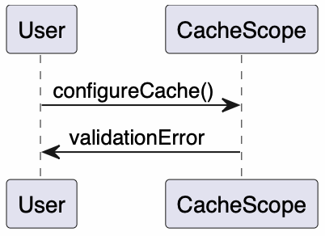
  <p><b>Fig. 2:</b> Configure Cache - Alternate Scenario </p>
</div>

## Failure Conditions
* invalid cache size
* invalid associativity
* invalid block size
* unsupported policy

## SSD-2 — Submit Memory Address
Related Use Cases
* UC-2.4 Input Memory Address
* UC-2.5 Translate Address
* UC-2.7 Search Cache Set
* UC-2.8 Detect Cache Hit
* UC-2.9 Detect Cache Miss
* UC-2.10 Update Cache State

## Goal
Submit and process memory address through cache-resolution workflow.

## System Events

| Actor                 | System             |
| :---                  | :---               |
| inputAddress(address) |                    |
|                       | validateAddress()  |
|                       | translateAddress() |
|                       | searchCache()      |
|                       | determineHitMiss() |
|                       | updateCacheState() |
|                       | returnResult()     |

## SSD Representation

<div align='center'>
  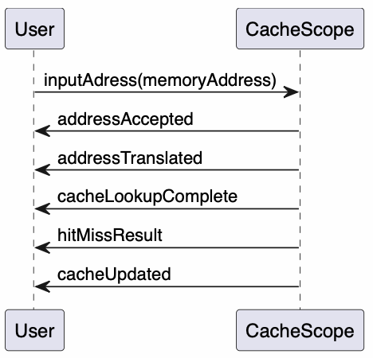
  <p><b>Fig. 3:</b> Submit Memory Address - Main Success Scenario </p>
</div>

## Alternate Flow

### Invalid address:

<div align='center'>
  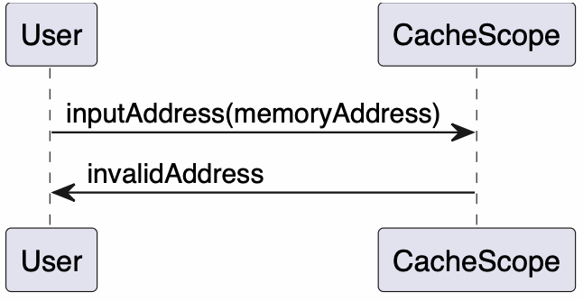
  <p><b>Fig. 4:</b> Submit Memory Address - Alternate Flow </p>
</div>

## Failure Conditions
* malformed address
* translation failure
* lookup failure
* cache update failure

## SSD-3 — Visualization Update
Related Use Cases
* UC-2.6 Visualize Address Bits

## Goal
Present translated address information visually.

## System Events

Actor	System
requestVisualization()	
	generateVisualization()
	renderAddressBits()
	updateUI()
	displayResults()

## SSD Representation

<div align='center'>
  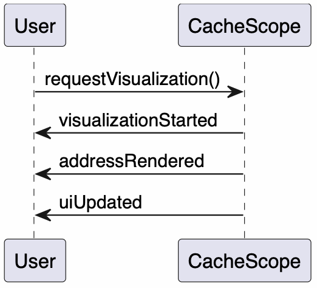
  <p><b>Fig. 5:</b> Visualization Update - Main Success Scenario </p>
</div>

## Alternate Flow

Educational mode:

<div align='center'>
  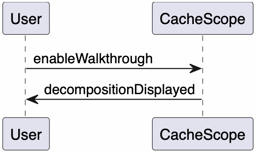
  <p><b>Fig. 6:</b> Visualization Update - Alternate Flow </p>
</div>

## Failure Conditions
* visualization unavailable
* rendering error
* synchronization error

## SSD Validation Checklist

Acceptance Criteria

| Check                       | Status   |
| :---                        | :---     |
| Every SSD maps to use cases | Required |
| System treated as black box | Required |
| Internal objects excluded   | Required |
| Actor events defined        | Required |
| Outputs defined             | Required |
| Alternate flows included    | Required |

## Traceability Mapping

| SSD                         | Source                 |
| :---                        | :---                   |
| SSD-1 Configure Cache       | US-1.1, UC-2.1–UC-2.3  |
| SSD-2 Submit Memory Address | US-1.2, UC-2.4–UC-2.10 |
| SSD-3 Visualization Update  | US-1.5, UC-2.6         |

## Acceptance Criteria
* SSDs exist for major workflows.
* Actor/system messages are defined.
* SSDs align with use cases.
* Alternate flows are documented.
* Failure conditions are documented.
* SSDs remain implementation-independent.
* Traceability is established.

## Technical Notes
* Keep SSDs in docs/ssd.md
* These SSDs become inputs to:
    * US-3.2 Sequence Diagrams
    * US-3.3 Design Class Diagram
    * US-3.4 GRASP Analysis
    * Operation Contracts

## Deliverables
* System Sequence Diagram specifications
* Actor/system interaction definitions
* Event catalog
* Traceability documentation
* Inputs for internal design artifacts

---

# US-3.2 — Create Sequence Diagrams
## Overview
Create Sequence Diagrams to model internal object collaboration within CacheScope. These diagrams refine the SSDs by identifying participating objects, message flows, control responsibilities, and interactions between controllers, entities, and supporting services.

#### The purpose is to:
* allocate responsibilities
* validate object interactions
* support GRASP analysis
* guide implementation
* verify class relationships
* prepare operation contracts

## User Story
As a software designer,
I want to model internal object interactions,
so that CacheScope implementation follows clear responsibility assignments and low-coupling design principles.

## Scope
#### Included:
* controller interactions
* entity interactions
* replacement-policy interactions
* cache-resolution workflows
* address-translation workflows
* visualization update workflows

#### Excluded:
* UI styling
* deployment logic
* testing workflows
* infrastructure concerns

## SD-1 — Configure Cache
#### Related Use Cases
* UC-2.1 Configure Cache
* UC-2.2 Validate Cache Configuration
* UC-2.3 Apply Cache Configuration

#### Participating Objects
```txt
User
CacheConfigurationView
ConfigurationController
Cache
AddressMapper
VisualizationController
Metrics
```

## Main Success Scenario

<div align='center'>
  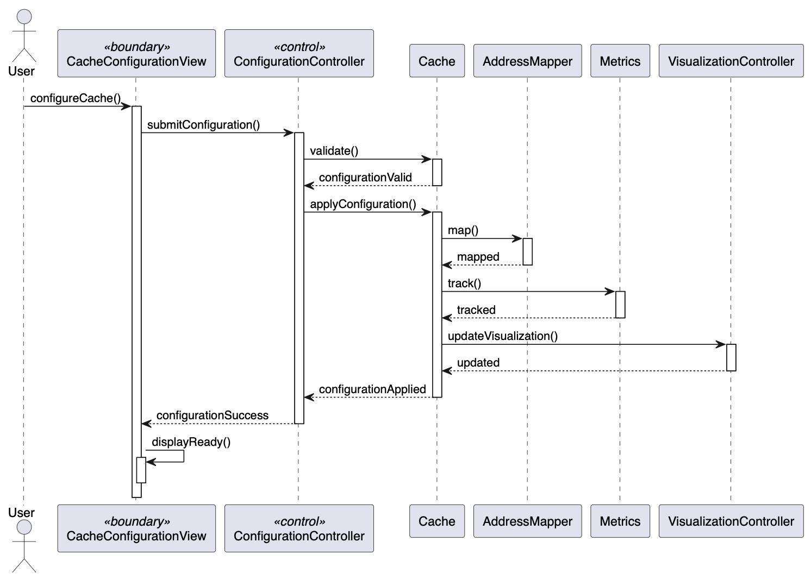
  <p><b>Fig. 1:</b> SD-1 Main Success Scenario </p>
</div>

## Responsibility Assignment

| Object                  | Responsibility             |
| :---                    | :---                       |
| CacheConfigurationView  | Capture user input         |
| ConfigurationController | Coordinate workflow        |
| Cache                   | Validate architecture      |
| AddressMapper           | Recalculate bit allocation |
| Metrics                 | Reset analytics            |
| VisualizationController | Refresh displays           |

## SD-2 — Process Memory Address
#### Related Use Cases
* UC-2.4 Input Memory Address
* UC-2.5 Translate Address

#### Participating Objects
```txt
User
AddressInputView
AddressProcessingController
AddressMapper
```

## Main Success Scenario

<div align='center'>
  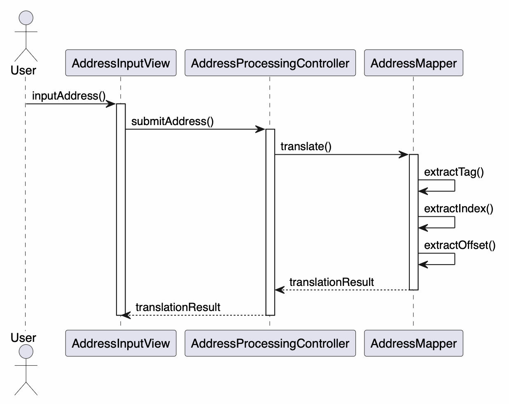
  <p><b>Fig. 2:</b> SD-2 Main Success Scenario </p>
</div>

## Responsibility Assignment

| Object                      | Responsibility        |
| :---                        | :---                  |
| AddressInputView            | Capture address       |
| AddressProcessingController | Coordinate processing |
| AddressMapper               | Perform decomposition |

## SD-3 — Cache Hit Resolution
#### Related Use Cases
* UC-2.7 Search Cache Set
* UC-2.8 Detect Cache Hit
* UC-2.10 Update Cache State

#### Participating Objects
```txt
AddressProcessingController
CacheResolutionController
Cache
CacheSet
CacheLine
ReplacementPolicy
Metrics
```

## Main Success Scenario

<div align='center'>
  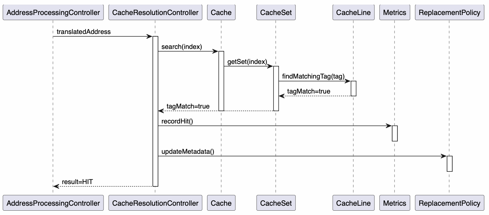
  <p><b>Fig. 3:</b> SD-3 Main Success Scenario </p>
</div>

## GRASP Notes
* CacheResolutionController = Controller
* CacheSet = Information Expert
* ReplacementPolicy = Polymorphism

## SD-4 — Cache Miss Resolution (Empty Line)
#### Related Use Cases
* UC-2.9 Detect Cache Miss
* UC-2.10 Update Cache State

#### Participating Objects
```txt
CacheResolutionController
Cache
CacheSet
CacheLine
Metrics
```

## Main Success Scenario

<div align='center'>
  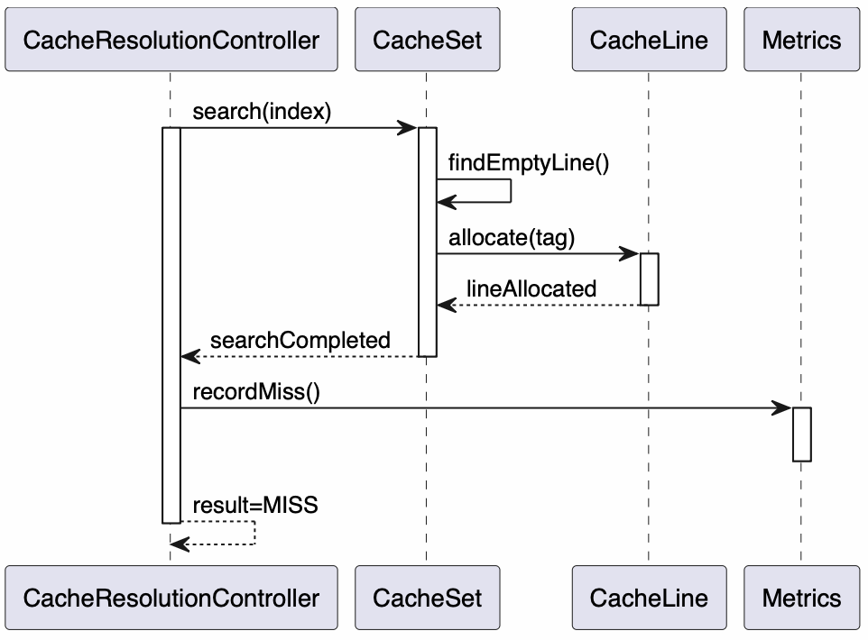
  <p><b>Fig. 4:</b> SD-4 Main Success Scenario </p>
</div>

## SD-5 — Cache Miss Resolution (Eviction Required)
#### Related Use Cases
* UC-2.9 Detect Cache Miss
* UC-2.10 Update Cache State

#### Participating Objects
```txt
CacheResolutionController
Cache
CacheSet
ReplacementPolicy
CacheLine
Metrics
```

## Main Success Scenario

<div align='center'>
  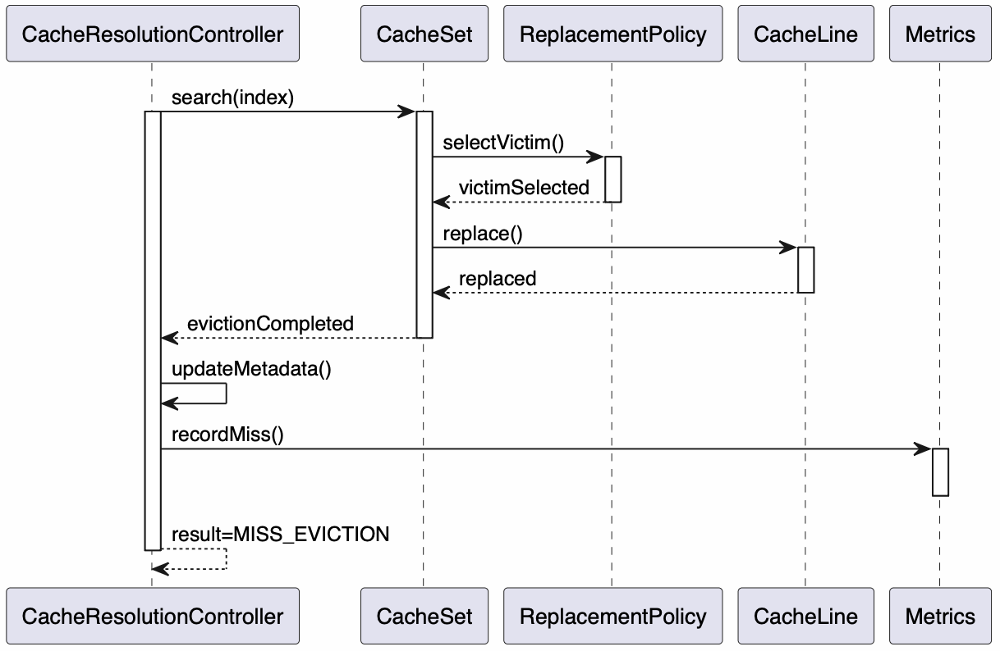
  <p><b>Fig. 5:</b> SD-5 Main Success Scenario </p>
</div>

## GRASP Notes

| Principle            | Object                    |
| :---                 | :---                      |
| Controller           | CacheResolutionController |
| Information Expert   | CacheSet                  |
| Polymorphism         | ReplacementPolicy         |
| Protected Variations | LRUPolicy/FIFOPolicy      |

## SD-6 — Visualization Update
#### Related Use Cases
* UC-2.6 Visualize Address Bits

#### Participating Objects
```txt
User
VisualizationController
AddressMapper
CacheVisualizationView
```

## Main Success Scenario

<div align='center'>
  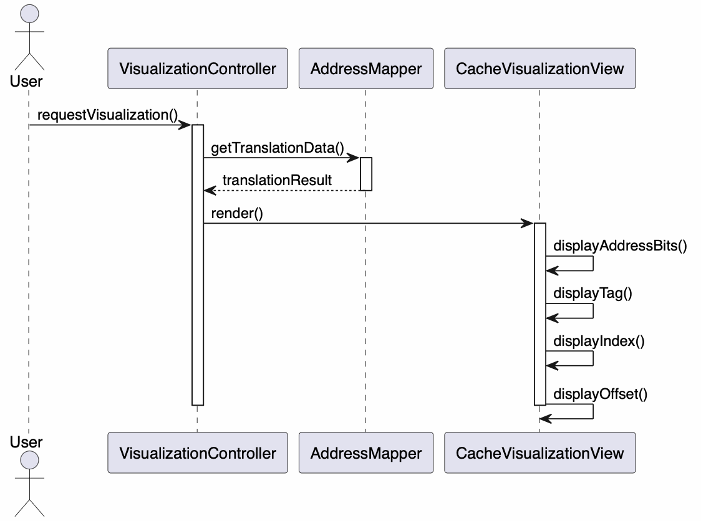
  <p><b>Fig. 6:</b> SD-6 Main Success Scenario </p>
</div>

## Sequence Diagram → Class Mapping

#### Sequence Diagram	Main Classes

| SD-1 | ConfigurationController, Cache             |
| :--- | :---                                       |
| SD-2 | AddressProcessingController, AddressMapper |
| SD-3 | CacheResolutionController, CacheSet        |
| SD-4 | CacheResolutionController, CacheLine       |
| SD-5 | ReplacementPolicy, CacheLine               |
| SD-6 | VisualizationController, AddressMapper     |

## Traceability

| Sequence Diagram | Source Use Cases       |
| :---             | :---                   |
| SD-1             | UC-2.1, UC-2.2, UC-2.3 |
| SD-2             | UC-2.4, UC-2.5         |
| SD-3             | UC-2.7, UC-2.8         |
| SD-4             | UC-2.9, UC-2.10        |
| SD-5             | UC-2.9, UC-2.10        |
| SD-6             | UC-2.6                 |

## Acceptance Criteria
* Sequence diagrams created for all major workflows.
* Participating objects identified.
* Message flow documented.
* Controller responsibilities assigned.
* Entity responsibilities assigned.
* GRASP alignment documented.
* Traceability to use cases established.
* Diagrams support implementation planning.

## Technical Notes
Store in:
```txt
docs/design/sequence-diagrams.md
```
